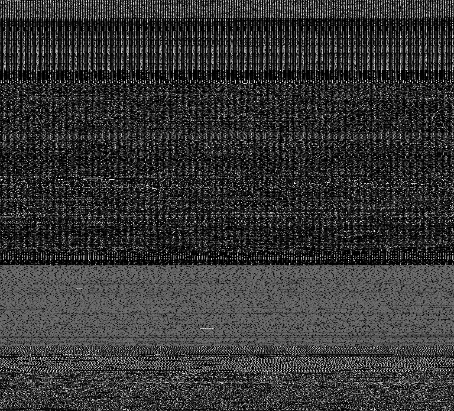
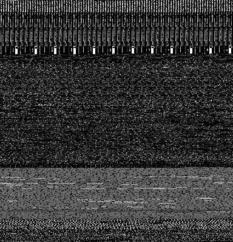

# UTIMG-Drebin-Top20-AndroidDEX

* To enable malware researchers to compare different classification approaches, we disclose how to create our dataset.

* This dataset contains 4,663 malware images from 20 different malware families. The original malware binary programs are included in the Drebin dataset. 

* When your papers use the dataset or script-tools for the dataset, please cite the following paper.

* R. Mitsuhashi and T. Shinagawa, <br>
"Exploring Optimal Deep Learning Models for Image-based Malware Variant Classification,"<br>
*2022 IEEE 46rd Annual Computer Software and Applications Conference (COMPSAC), 2022.*

# How to create the dataset
### 1. Apply for the Drebin dataset download

* https://www.sec.cs.tu-bs.de/~danarp/drebin/

### 2. Access to the Drebin download site 

* https://www.sec.cs.tu-bs.de/~danarp/drebin/download.html
* Download drebin-0.zip, drebin-1.zip, drebin-2.zip, drebin-3.zip drebin-4.zip,and drebin-5.zip

### 3. Unzip malware files
* See the reply e-mail.
* Note that these are real malware.

### 4. Make directory and copy malware files
* The following steps are confirmed in Ubuntu 20.04 LTS.
```
./00_make_directory.sh
```
* Copy your unzipped malware files to "virustotal" directory.
```
find /media/user/usb/drebin-012345 -type f | xargs -i cp {} ./drebin
```


* Check the file type. 
```
file ./drebin/fff29f78324c75c8727426d77b128d3ee9df7ba6a1f0be1617be3430ed99d050
```
-> Java archive data (JAR)

### 5. Create the dataset
```
sudo apt-get install pnmtopng
```
```
./01_binary_copy.sh
```
```
./02_malwareimage.sh
```
```
./03_image_copy.sh
```


### 6. Check the results
```
tar zcvf dataset.tar.gz ./dataset
```
```
sha256sum ./dataset.tar.gz
```
-> 285794ef7c0a4297e7d75e17d9c06bb205609d5ff7681788d12aed9f6f099bb3 
```
cd ./dataset
```

* 01/0c49a873f66c286996debf6c523c5236b258e0aa48c49c10f211c641b3bcb7c0.dex.png


* 02/0a38aa7610cec274806a1c8c909091eaca98f0cd71796adc0c8af29f693ad253.dex.png

