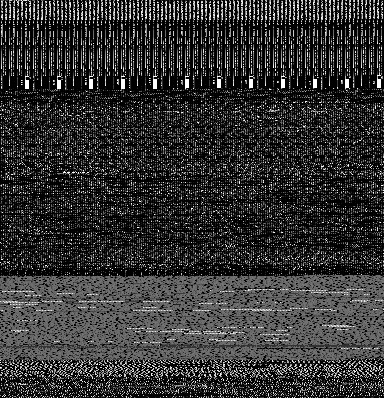

# The DR-20-DEX-Image dataset

* To enable malware researchers to compare different classification approaches, we disclose how to create our dataset.

* This dataset contains 4,663 malware images from 20 different malware families. The original malware binary programs are included in the Drebin dataset. 

* If your papers use the dataset or the script-tools for the dataset, please cite the following paper.

* Rikima Mitsuhashi and Takahiro Shinagawa, <br>
"Exploring Optimal Deep Learning Models for Image-based Malware Variant Classification,"<br>
*2022 IEEE 46th Annual Computers, Software, and Applications Conference (COMPSAC), 2022.*<br>
https://doi.org/10.1109/COMPSAC54236.2022.00128

# How to create the dataset
### 1. Apply for downloading the Drebin dataset

* https://www.sec.cs.tu-bs.de/~danarp/drebin/

### 2. Download the Drebin dataset 

* https://www.sec.cs.tu-bs.de/~danarp/drebin/download.html <br>
-> drebin-0.zip, drebin-1.zip, drebin-2.zip, drebin-3.zip drebin-4.zip,and drebin-5.zip

### 3. Unzip the downloaded files
* A password is written in the reply-mail from the administrator of the Drebin dataset.
* Note that the unzipped files are real malware.

### 4. Make directory and copy malware files
* The following steps are confirmed in Ubuntu 20.04 LTS.
```
./00_make_directory.sh
```
* Copy your unzipped malware files to "drebin" directory.
* "/media/user/usb/drebin-012345" should be changed to suit your environment.
```
find /media/user/usb/drebin-012345 -type f | xargs -i cp {} ./drebin
```

* Check the file type. 
```
file ./drebin/fff29f78324c75c8727426d77b128d3ee9df7ba6a1f0be1617be3430ed99d050
```
  -> Java archive data (JAR)
  

### 5. Create the dataset
```
sudo apt-get install pnmtopng
```
```
./01_binary_copy.sh
```
```
./02_get_dex.sh
```
```
./03_malwareimage.sh
```
```
./04_image_copy.sh
```


### 6. Check the results
```
zip -r -X Drebin-20-DEX-Image.zip ./dataset
```
```
sha256sum ./Drebin-20-DEX-Image.zip
```
-> e9994c9a4a3c7ad8dba1df7d478ac67c2da7d87fe5621478a60aa03003093662
```
eog ./dataset/01/0c49a873f66c286996debf6c523c5236b258e0aa48c49c10f211c641b3bcb7c0.dex.png
```


```
eog ./dataset/02/0a38aa7610cec274806a1c8c909091eaca98f0cd71796adc0c8af29f693ad253.dex.png
```


# References
* The VT-May-2020-Windows-Image dataset
* https://github.com/rikima-mitsuhashi/VT-May-2020-Windows-Image
* The VT-May-2020-Android-Image dataset
* https://github.com/rikima-mitsuhashi/VT-May-2020-Android-Image
